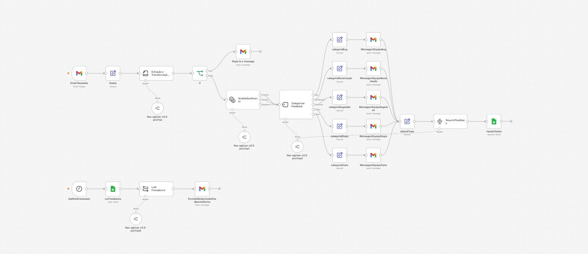
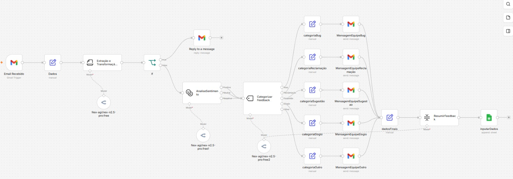
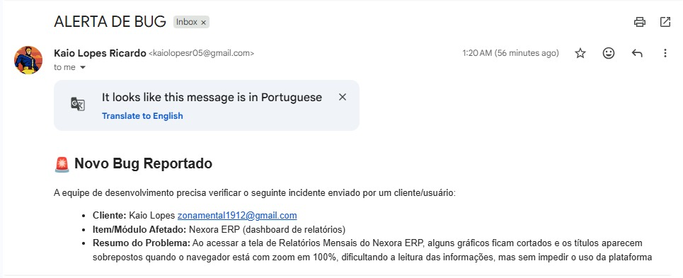
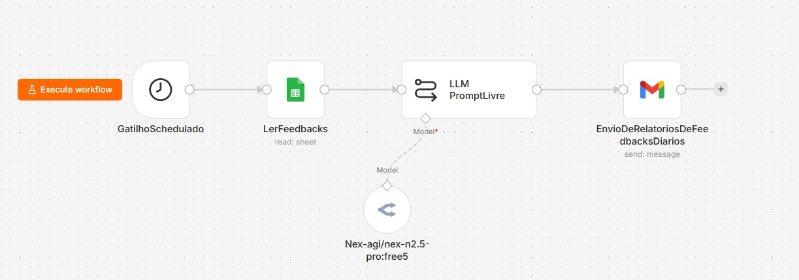
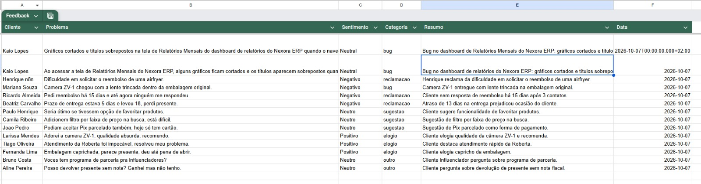

# AI Feedback Intelligence

Sistema automatizado de triagem, análise, categorização e consolidação de feedbacks utilizando **n8n, Inteligência Artificial, Gmail, Google Sheets e OpenRouter**.

O projeto foi desenvolvido com foco em automação de processos, integração entre sistemas e uso prático de IA para tratamento de feedbacks.

---

## Visão Geral

O **AI Feedback Intelligence** automatiza o tratamento de feedbacks recebidos por e-mail.

A solução é capaz de:

- receber feedbacks via Gmail;
- extrair informações relevantes;
- identificar casos urgentes;
- analisar o sentimento da mensagem;
- classificar o feedback;
- direcionar a mensagem para a categoria correta;
- enviar notificações para as equipes responsáveis;
- registrar os dados em uma base no Google Sheets;
- gerar um briefing executivo diário com os feedbacks registrados.

O projeto é dividido em dois fluxos principais.

---

## Arquitetura Geral

---

# Fluxo 01 — Triagem e Roteamento Inteligente de Feedbacks

Esse fluxo é responsável pelo processamento individual de cada feedback recebido.

### Etapas do fluxo

1. Recebimento do e-mail através do Gmail Trigger
2. Organização dos dados recebidos
3. Extração e transformação das informações com IA
4. Verificação de urgência
5. Análise de sentimento
6. Classificação do feedback
7. Roteamento por categoria
8. Envio de e-mail para a equipe responsável
9. Consolidação dos dados
10. Registro no Google Sheets

### Categorias utilizadas

- Bug
- Reclamação
- Sugestão
- Elogio
- Outro

### Exemplo de e-mail enviado para a equipe

---

# Fluxo 02 — Briefing Executivo Diário de Feedbacks

Esse fluxo é executado automaticamente através de um **Schedule Trigger**.

O fluxo consulta os feedbacks registrados no Google Sheets e utiliza IA para gerar um resumo executivo diário.

### Etapas do fluxo

1. Execução agendada
2. Leitura dos feedbacks registrados no Google Sheets
3. Envio dos dados para um modelo de IA
4. Geração de briefing executivo
5. Envio do relatório por e-mail

O briefing apresenta informações como:

- volume de feedbacks;
- sentimentos predominantes;
- categorias;
- principais problemas;
- destaques;
- recomendações.

### Exemplo de relatório

[Visualizar relatório diário em PDF](relatorio-feedbacks-diarios.pdf)

---

## Base de Dados

O Google Sheets foi utilizado como base de dados do projeto.

Os principais campos armazenados são:

- Cliente
- Problema
- Sentimento
- Categoria
- Resumo
- Data

---

# Tecnologias Utilizadas

## Automação e Orquestração

- n8n
- Gmail Trigger
- Schedule Trigger
- Edit Fields / Set
- IF
- Gmail
- Google Sheets

## Inteligência Artificial

Foram utilizados diferentes componentes de IA dentro do n8n:

- Information Extractor
- Basic LLM Chain
- Sentiment Analysis
- Text Classifier
- Summarization Chain

Os modelos de linguagem utilizados foram acessados através da **OpenRouter**, utilizando modelos gratuitos para execução das tarefas de IA.

## Integrações

- Gmail
- Google Sheets
- OpenRouter

## Google Sheets

Operações utilizadas:

- Append Row in Sheet
- Get Row(s) in Sheet

## Autenticação

- OAuth 2.0 via Google Cloud
- API Key da OpenRouter

A mesma configuração OAuth do Google Cloud foi utilizada para autenticação das integrações com Gmail e Google Sheets.

## Infraestrutura

- n8n Self-Hosted
- VPS Hostinger
- Ubuntu

---

# Workflow

O workflow completo do projeto está disponível neste repositório:

[Abrir workflow do n8n](AIFeedbackIntelligence.json)

---

## Exemplo de Funcionamento

Um cliente envia um e-mail relatando um problema.

O fluxo:

1. recebe a mensagem;
2. extrai as principais informações;
3. identifica a urgência;
4. analisa o sentimento;
5. classifica o feedback;
6. direciona o atendimento;
7. envia uma notificação para a equipe responsável;
8. registra os dados no Google Sheets.

Posteriormente, o segundo fluxo utiliza os feedbacks acumulados para gerar automaticamente um briefing executivo diário.

---

# Objetivo do Projeto

Este projeto foi desenvolvido como parte dos meus estudos em:

- automação de processos;
- n8n;
- inteligência artificial;
- RPA;
- integrações;
- APIs;
- autenticação;
- tratamento e persistência de dados.

O principal objetivo foi desenvolver uma automação completa, passando desde o recebimento de uma informação até sua classificação, roteamento, armazenamento e utilização para geração de insights.

---

# Possíveis Evoluções

Algumas melhorias que podem ser implementadas futuramente:

- banco de dados dedicado;
- dashboard de indicadores;
- histórico de atendimento por cliente;
- integração com sistema de tickets;
- integração com Microsoft Teams ou Slack;
- notificações via WhatsApp;
- tratamento centralizado de erros;
- logs e monitoramento;
- métricas de tempo de resposta;
- classificação de severidade;
- integração com CRM;
- uso de agentes de IA.

---

# Segurança

Nenhuma credencial sensível foi incluída neste repositório.

Não são armazenados no projeto:

- Client Secret;
- Access Token;
- Refresh Token;
- API Keys;
- senhas;
- credenciais de Gmail;
- credenciais do Google Sheets.

As autenticações são configuradas diretamente no ambiente do n8n.

---

# Autor

**Kaio Lopes Ricardo**

Projeto desenvolvido para estudo e portfólio nas áreas de:

**Automação | RPA | n8n | Inteligência Artificial | Integrações | APIs**
